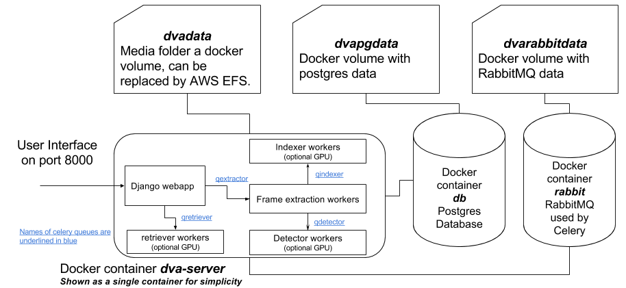
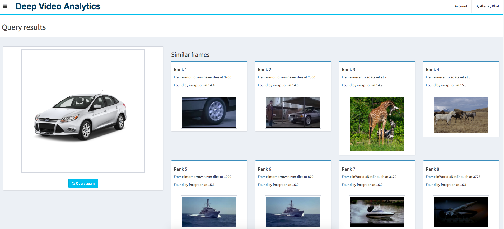
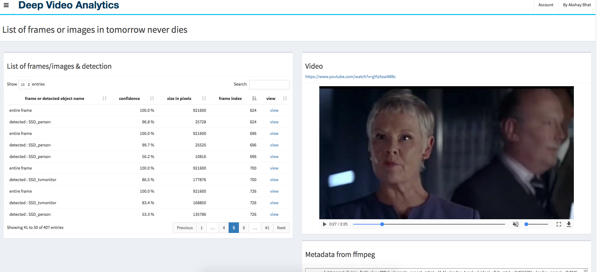
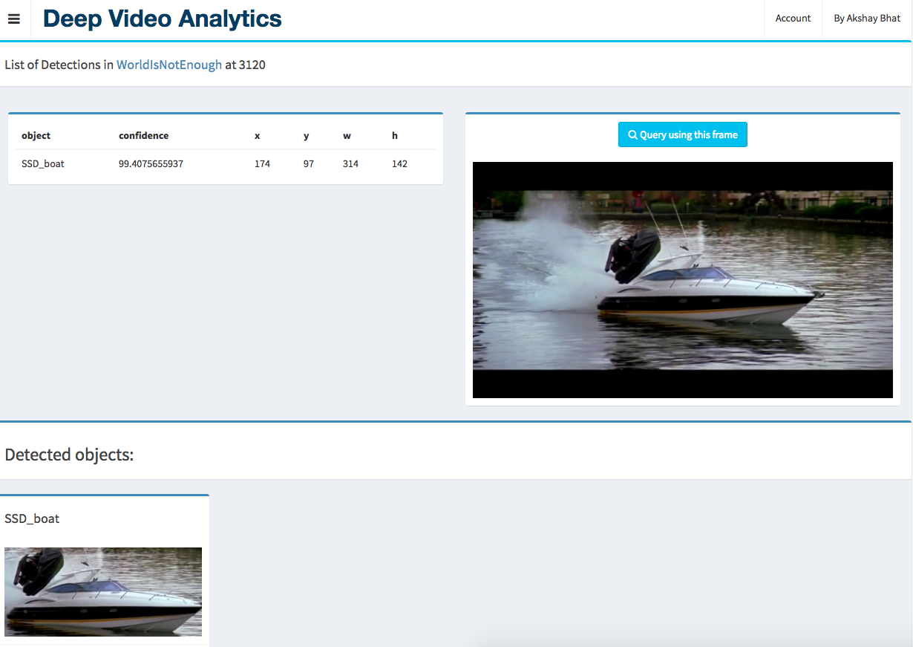

#Deep Video Analytics  •  [](https://travis-ci.org/AKSHAYUBHAT/DeepVideoAnalytics)


#### Author: [Akshay Bhat, Cornell University.](http://www.akshaybhat.com)       


Deep Video Analytics provides a platform for indexing and extracting information from videos and images.
Deep learning detection and recognition algorithms are used for indexing individual frames / images along with 
detected objects. The goal of Deep Video analytics is to become a quickly customizable platform for developing 
visual & video analytics applications, while benefiting from seamless integration with state or the art models released
by the vision research community.

##### self-promotion: If you are interested in Healthcare & Machine Learning please take a look at my another Open Source project [Computational Healthcare](http://www.computationalhealthcare.com) 

## Features
- Visual Search using Nearest Neighbors algorithm as a primary interface
- Upload videos, multiple images (zip file with folder names as labels)
- Provide Youtube url to be automatically processed/downloaded by youtube-dl
- Metadata stored in Postgres
- Operations (Querying, Frame extraction & Indexing) performed using celery tasks and RabbitMQ
- Separate queues and workers for selection of machines with different specifications (GPU vs RAM) 
- Videos, frames, indexes, numpy vectors stored in media directory, served through nginx
- Explore data, manually run code & tasks without UI via a jupyter notebook [explore.ipynb](experiments/Notebooks/explore.ipynb)
- [Some documentation on design decision, architecture and deployment](/notes/readme.md).

## Implemented algorithms/models
- [x] Google inception using Tensorflow
- [x] [SSD Multibox 300](https://github.com/balancap/SSD-Tensorflow)  
- [x] Alexnet indexing using Pytorch  (disabled by default; set ALEX_ENABLE=1 in environment variable to use)
- [x] [YOLO 9000](http://pjreddie.com/darknet/yolo/) (disabled by default; set YOLO_ENABLE=1 in environment variable to use)

## Potential algorithms/models
- [ ] [Text detection models](http://www.robots.ox.ac.uk/~vgg/research/text/)
- [ ] [Pytorch Squeezenet](http://pytorch.org/docs/torchvision/models.html)
- [ ] [Openface (via a connected container)](https://github.com/cmusatyalab/openface)
- [ ] [Soundnet (requires extracting mp3 audio)](http://projects.csail.mit.edu/soundnet/)
- [ ] [Mapnet (requires converting models from Marvin)](http://www.cs.princeton.edu/~aseff/mapnet/)   
- [ ] [Keras-js](https://github.com/transcranial/keras-js) which uses Keras inception for client side indexing   

### Open Issues

- [ ] [OpenCV fails with double free error at cap.release() on some ubuntu machines in spite of running in a docker](https://github.com/AKSHAYUBHAT/DeepVideoAnalytics/issues/4)
- [ ] [Running SSD-Tensorflow in a celery task, the code aborts during second task, as a result its reloaded every time via subprocess](https://github.com/AKSHAYUBHAT/DeepVideoAnalytics/issues/3)

### To Do

[Please take a look at this board](https://github.com/AKSHAYUBHAT/DeepVideoAnalytics/projects/1)


## Installation

**Pre build docker images for both CPU and GPU version are now [available on Docker Hub](https://hub.docker.com/r/akshayubhat/dva/tags/).** 

### On Mac, Windows and Linux machines without NVidia GPUs
You need to have latest version of Docker installed.
````bash
git clone https://github.com/AKSHAYUBHAT/DeepVideoAnalytics && cd DeepVideoAnalytics/docker && docker-compose up 
````
### Installation for machines with GPU or AWS P2.xlarge instances

#### Machine with NVidia GPU with Docker and nvidia-docker installed
Replace docker-compose by nvidia-docker-compose, the Dockerfile uses tensorflow gpu base image and appropriate version of pytorch. The Makefile for Darknet is also modified accordingly. This code was tested using an older NVidia Titan GPU and nvidia-docker.

```bash
pip install --upgrade nvidia-docker-compose
git clone https://github.com/AKSHAYUBHAT/DeepVideoAnalytics && cd DeepVideoAnalytics/docker_GPU && ./rebuild.sh && nvidia-docker-compose up 
```
##### AWS EC2 AMI available
Start a P2.xlarge instance with **ami-b3cc1fa5** (N. Virginia), ports 8000, 6006, 8888 open (preferably to only your IP) and run following command after ssh'ing into the machine. 
```bash
cd deepvideoanalytics && git pull && cd docker_GPU && ./rebuild.sh && nvidia-docker-compose up 
```
you can optionally specify "-d" at the end to detach it, but for the very first time its useful to read how each container is started. After approximately 3 ~ 5 minutes the user interface will appear on port 8000 of the instance ip.
The Process used for [AMI creation is here](https://github.com/AKSHAYUBHAT/DeepVideoAnalytics/blob/master/notes/ami.md) **Security warning!** The current GPU container uses nginx <-> uwsgi <-> django setup to ensure smooth playback of videos. 
However it runs nginix as root (though within the container). Considering that you can now modify AWS Security rules on-the-fly, I highly recommend allowing inbound traffic only from your own IP address.

### Deployment on multiple machines with/without GPUs
Other than the shared media folder (ideally a mounted EFS or NFS), Postgres and RabbitMQ are straightforward.
Please [read this regarding trade offs](https://github.com/AKSHAYUBHAT/DeepVideoAnalytics/blob/master/notes/architecture.md).

### Options specified via environment variable  
**E.g. by specifying them in docker-compose.yml**

- ALEX_ENABLE=1 (to use Alexnet with PyTorch. Otherwise disabled by default)
- YOLO_ENABLE=1 (to use YOLO 9000. Otherwise disabled by default)
- SCENEDETECT_DISABLE=1 (to disable scene detection, Otherwise enabled by default)

 
## Architecture


## User Interface 
### Search

### Past queries

### Video list / detail


### Frame detail


## Libraries & Code used

- Pytorch [License](https://github.com/pytorch/pytorch/blob/master/LICENSE)
- Darknet [License](https://github.com/pjreddie/darknet/blob/master/LICENSE)
- AdminLTE2 [License](https://github.com/almasaeed2010/AdminLTE/blob/master/LICENSE)
- FabricJS [License](https://github.com/kangax/fabric.js/blob/master/LICENSE)
- Modified PySceneDetect [License](https://github.com/Breakthrough/PySceneDetect)
- Modified SSD-Tensorflow [Individual files are marked as Apache](https://github.com/balancap/SSD-Tensorflow)
- FAISS [License (Non Commercial)](https://github.com/facebookresearch/faiss)
- Docker 
- Nvidia-docker
- OpenCV
- Numpy
- FFMPEG
- Tensorflow

## References


## Citation for Deep Video Analytics

**Coming soon!**

# Copyright
**Copyright 2016-2017, Akshay Bhat, Cornell University, All rights reserved.**
